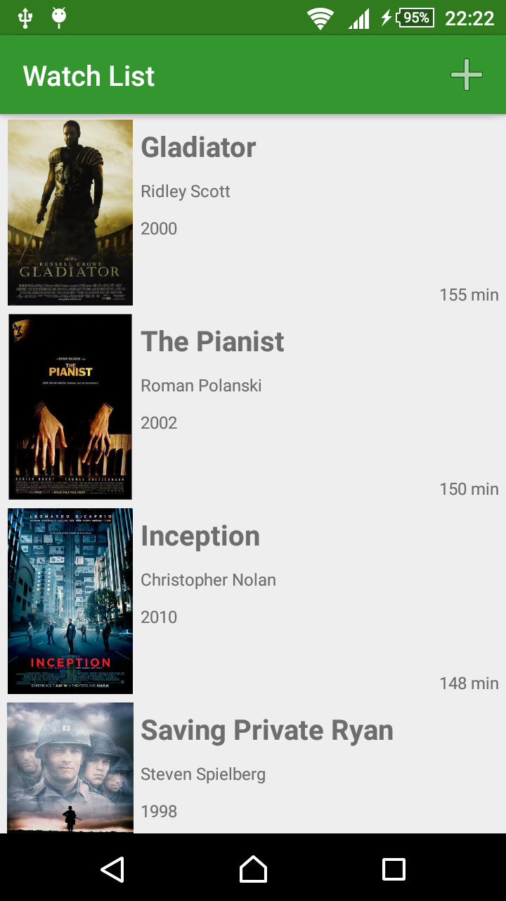
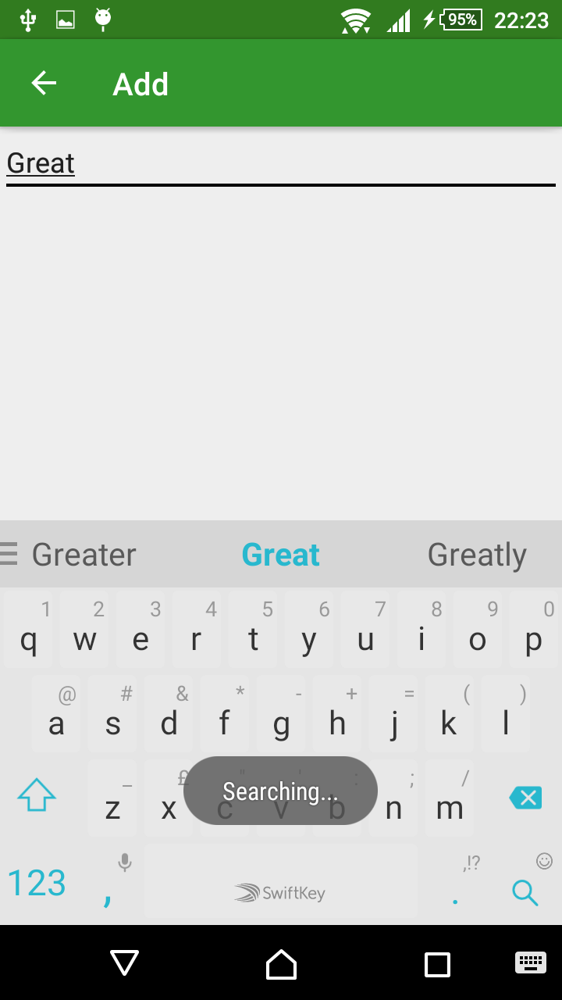
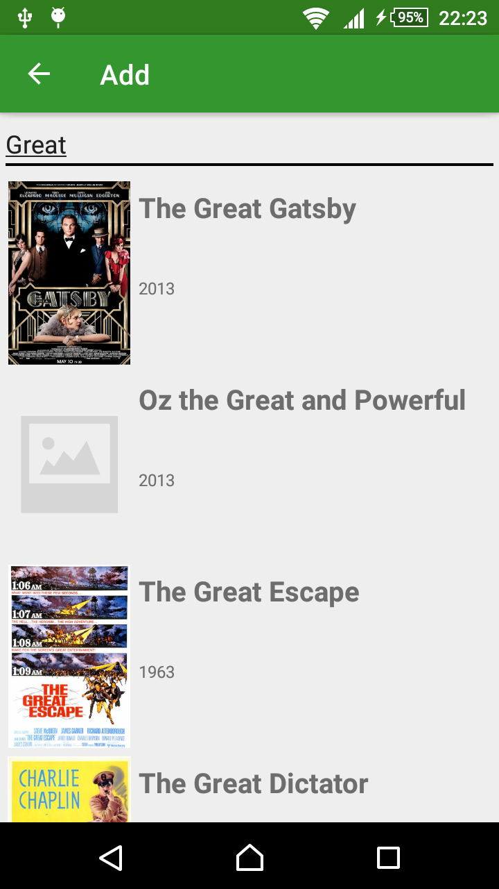
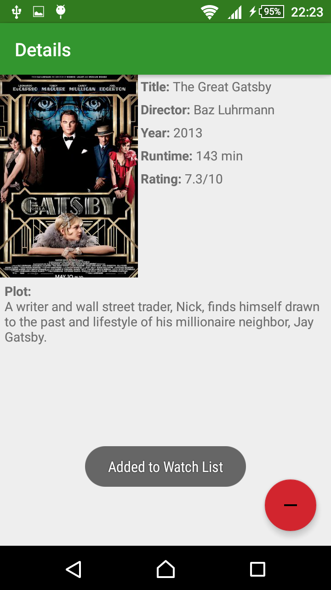

# Native App Studio: Watch List
By Matthew van Rijn (10779353)

This app allows you to search for films, view their details and add them to a watch list

### Activities
The app consists of three activities. The main activity shows the watch list. This activity has a child activity which searches and displays search results. The third activity shows details about a film, and can be accessed from both other activities.

#### Watch List
The watch list is the main feature of the app, and therefore the main activity. From here the user can tap the plus button to search for a film to add to the watch list, tap a film to view it's details or swipe a film to the right to remove it from the watch list after confirmation.

#### Search
This is where the user ends up when they press the add button from the watch list. At first all that is visible is a search bar prompting the user to enter the name of a film. When the query has been entered they can press the search button on their keyboard to search. Because this can take some time, a message appears to confirm that the search has started. When the search is complete, the results are displayed in the same way that they would be on the watch list. If there are no results, a message appears. From the results list the user can tap a film to view it's details and add it to their watch list, or press the up or back button to return to the watch list.

#### Story
The details screen shows the film title, director, year, runtime, rating and plot. In the bottom-right corner there is a floating button which allows the user to add or remove this film from their watch list. When they do so a confirmation message pops up and the button changes colour. If the plot is too large it will scroll, but the rest of the information will stay put.

